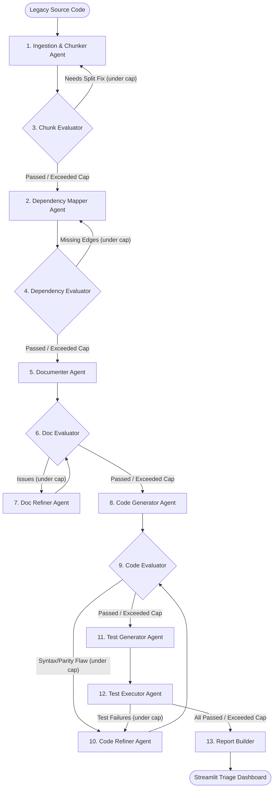

# Legacy Code Modernization Agentic System ⚡

An autonomous, multi-agent system built on **LangGraph**, **LangChain**, **NetworkX**, and **Streamlit** that converts legacy **COBOL**, **Visual Basic**, and **Java** codebases into modern, tested, and documented **Python 3.11+** services.

---

## 🌟 Key Features

- **Multi-Language Ingestion & Parsing**: Parses semantic paragraphs (COBOL), modules/classes (VB), and classes/methods (Java).
- **Cross-Chunk Dependency Mapping**: Analyzes and constructs NetworkX directed graphs for inter-chunk procedure calls, copybooks, shared data, and file/DB I/O.
- **Automated Documentation**: Synthesizes formal specifications (purpose, inputs, outputs, business formulas, control flow).
- **LLM-as-Judge & Static Validation**: Multi-stage evaluation of documentation completeness, Python syntax AST, cyclomatic complexity, and functional parity.
- **Refinement Loops with Retry Caps**: Automated iteration between Evaluators and Refiners with configurable retry limits (`configs/thresholds.yaml`).
- **Autonomous Pytest Generation & Sandbox Execution**: Derives unit tests directly from documented business rules and executes them in an isolated sandbox.
- **Three-State Observability Dashboard**: Streamlit dashboard categorizing chunks into **Auto-Passed**, **Auto-Passed after Refinement**, and **Flagged for Human Review**, sorted lowest-confidence first.

---

## 🏗 System Architecture



---

## 📁 Repository Structure

```
legacy-modernizer/
├── README.md
├── pyproject.toml
├── .env.example
├── configs/
│   ├── agents.yaml             # Agent pipeline switches & stage configs
│   ├── llm_config.yaml         # LLM provider, models, and temperature per agent
│   └── thresholds.yaml         # Retry caps and confidence cutoffs
├── src/
│   ├── orchestrator/
│   │   ├── graph.py            # LangGraph StateGraph & CLI main runner
│   │   ├── state.py            # Pydantic models & PipelineState TypedDict
│   │   └── router.py           # Conditional routing logic with retry limits
│   ├── agents/
│   │   ├── base_agent.py       # LLM provider & structured invocation base
│   │   ├── ingestion_chunker.py
│   │   ├── dependency_mapper.py
│   │   ├── chunk_evaluator.py
│   │   ├── dependency_evaluator.py
│   │   ├── documenter.py
│   │   ├── doc_evaluator.py
│   │   ├── doc_refiner.py
│   │   ├── code_generator.py
│   │   ├── code_evaluator.py
│   │   ├── code_refiner.py
│   │   ├── test_generator.py
│   │   └── test_executor.py
│   ├── parsers/
│   │   ├── cobol_parser.py     # COBOL DIVISION, SECTION, PARAGRAPH parser
│   │   ├── vb_parser.py        # VB6 / VB.NET Sub, Function, Module parser
│   │   └── java_parser.py      # Java Class, Interface, Method parser
│   ├── tools/
│   │   ├── ast_tools.py        # AST inspection and language detection
│   │   ├── graph_tools.py      # NetworkX topological sort and cycle detection
│   │   ├── static_analysis_tools.py # Python syntax & cyclomatic complexity
│   │   └── sandbox_exec.py     # Isolated temporary subprocess pytest execution
│   ├── prompts/                # Pydantic-structured system and human prompts
│   ├── evaluation/
│   │   ├── metrics.py          # Confidence score & 3-state classification
│   │   ├── rubric.yaml         # Quality rubric criteria & weights
│   │   └── report_builder.py   # State aggregation into JSON reports
│   └── dashboard/
│       ├── app.py              # Streamlit Web App
│       └── components/         # Metric cards, Triage table, Diffs, Graph
├── data/
│   └── legacy_source/          # Synthetic COBOL, VB, and Java code samples
├── outputs/
│   └── evaluation_reports/     # Generated JSON run audit trails
├── tests/                      # Pytest unit and E2E test suites
└── notebooks/                  # Interactive demo Jupyter notebook
```

---

## 🚀 Quickstart Guide

### 1. Installation & Environment Setup

```bash
# Clone and navigate to repository
cd "GenAI - UC2"

# Install package and dependencies in editable mode
pip install -e .

# Configure API keys (or leave LLM_PROVIDER=mock for offline verification)
cp .env.example .env
```

### 2. Run the Multi-Agent Modernization Pipeline

Execute the autonomous pipeline on the synthetic sample files:

```bash
# Run via module execution
python -m src.orchestrator.graph

# Or execute on specific files
python -m src.orchestrator.graph data/legacy_source/loan_calculator.cbl
```

### 3. Launch the Observability Dashboard

```bash
streamlit run src/dashboard/app.py
```

---

## 📊 Three-State Classification System

The dashboard categorizes each migrated chunk into one of three explicit states:

| Status | Badge | Description | Action Required |
| :--- | :--- | :--- | :--- |
| **Auto-Passed** | 🟢 Green | Satisfied all quality thresholds on v1 without any evaluator rejection. | None (Ready for production). |
| **Auto-Passed (Refined)** | 🟡 Yellow | Failed initial evaluation but successfully corrected via automated refinement loops within retry caps. | Optional sanity check of diffs. |
| **Flagged for Human Review** | 🔴 Red | Unresolved issues after exhausting max retries or flagged for manual check. | **Reviewer must inspect** via dashboard diff viewer. |

---

## ⚙ Configuration & Customization

### `configs/thresholds.yaml`
```yaml
retry_caps:
  chunking: 2
  dependency_mapping: 2
  documentation: 3
  code_generation: 3
  test_generation: 3

confidence_thresholds:
  chunk_evaluation: 0.85
  dependency_evaluation: 0.85
  doc_evaluation: 0.80
  code_evaluation: 0.85
  test_coverage_min_pct: 80.0
```

### `configs/llm_config.yaml`
```yaml
default:
  provider: "openai" # "openai", "anthropic", or "mock"
  model: "gpt-4o"
  temperature: 0.2

agents:
  doc_evaluator:
    temperature: 0.0 # Deterministic LLM-as-judge
  code_evaluator:
    temperature: 0.0
```

---

## 🧪 Running Unit & Integration Tests

Run the full pytest suite:

```bash
pytest tests/ -v
```

---

## 🔌 Integrating Real Legacy Codebases

1. Place legacy source files into `data/legacy_source/` (or any custom directory).
2. Set your `OPENAI_API_KEY` or `ANTHROPIC_API_KEY` in `.env` and set `LLM_PROVIDER=openai`.
3. Run `python -m src.orchestrator.graph /path/to/your/files/*`.
4. Open the Streamlit dashboard to inspect triage rankings, visual diffs, and generated pytest results!
