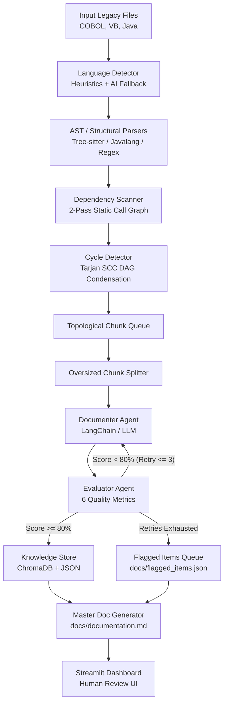

# GenAI Legacy Code Understanding & Conversion System (Phase 1)

An enterprise-grade, multi-language static analysis and generative AI pipeline designed to ingest legacy source code (COBOL, Visual Basic / VBA, Java), discover functional dependencies, eliminate circular call graphs, and generate high-fidelity, verified business & technical specifications.

---

## 🌟 Key Features

- **Multi-Language Ingestion & Parsing:**
  - **Java:** Native AST extraction with Tree-sitter & `javalang` fallback, plus regex fallbacks.
  - **COBOL:** Structural division/section parser and `PROGRAM-ID` paragraph extractor.
  - **Visual Basic (VB6 / VBA / .NET):** Method and subroutine block parsers (`Sub`, `Function`, `Property`).
- **Two-Tier Language Detection:** Fast content-hash and heuristic signature scoring with LLM fallback only for genuinely ambiguous files.
- **Dependency & Call Graph Extraction:** 2-pass static analysis building a NetworkX Directed Graph (`nx.DiGraph`) mapping intra- and cross-file calls.
- **Cycle Condensation & Topological Ordering:** Resolves circular call loops via Tarjan's Strongly Connected Components (SCC) algorithm to produce a strict DAG.
- **Intelligent Chunking & Context Splitting:** Recursive code splitter keeping functional boundaries intact and ensuring LLM context window safety.
- **Agentic Documentation & Self-Evaluation Loop:**
  - **Documenter Agent:** Generates business logic summaries, variables, formulas, and edge cases.
  - **Evaluator Agent:** Scores documentation across 6 quality dimensions with automated refinement retries (up to 3x) before flagging low-scoring chunks.
- **Master Specification Assembly:** Merges verified chunk specs into a cohesive, publication-ready Master Markdown Document with summary tables.
- **Interactive Human Review Dashboard:** Streamlit UI for reviewing generated documentation, flagged items, and knowledge store inspection.

---

## 🏗️ Architecture & Pipeline Flow



---

## 📂 Repository Structure

```
├── .knowledge_store/         # Persistent vector & metadata store
├── docs/                     # Generated documentation & evaluation artifacts
│   ├── documentation.md      # Generated Master Markdown Specification
│   ├── flagged_items.json    # Chunks requiring manual SME review
│   └── README.md
├── logs/                     # Timestamped run logs
├── samples/                  # Legacy test codebases
│   ├── cobol/                # COBOL programs (.cbl, .cob)
│   ├── java/                 # Java classes (.java)
│   ├── vb/                   # Visual Basic / VBA modules (.bas, .frm)
│   └── README.md
├── src/                      # Core system source code
│   ├── agents/               # Documenter, Evaluator, and Splitter agents
│   ├── dashboard/            # Streamlit Human-in-the-Loop review UI
│   ├── knowledge_store/      # Vector store & metadata repository
│   ├── orchestrator/         # LangGraph Phase 1 StateGraph workflow
│   ├── parsing/              # Two-tier language detection engine
│   ├── tools/                # Dependency scanner & cycle condensation tools
│   ├── utils/                # AST parsers, LLM wrapper, and logging configuration
│   ├── schemas.py            # Pydantic data schemas
│   ├── state.py              # Pipeline state definition
│   └── README.md
├── tests/                    # Automated Pytest suite
│   └── README.md
├── demo.py                   # Lightweight parsing & chunking CLI demo
├── main.py                   # Main CLI entry point for full pipeline
├── run_phase1.py             # Direct runner for the Phase 1 LangGraph workflow
├── pytest.ini                # Pytest configuration
├── requirements.txt          # Python dependencies
└── README.md                 # Project root README (this file)
```

---

## 🚀 Quick Start

### 1. Environment Setup

```bash
# 1. Create and activate a Python 3.10+ virtual environment
python -m venv venv
venv\Scripts\activate      # On Windows
# source venv/bin/activate # On Linux/macOS

# 2. Install dependencies
pip install -r requirements.txt
```

### 2. Configure API Keys

Create a `.env` file in the root directory:
```env
# Choose your preferred LLM provider:
OPENAI_API_KEY=your_openai_key
# or
ANTHROPIC_API_KEY=your_anthropic_key
# or
GOOGLE_API_KEY=your_google_key
# or
HUGGINGFACEHUB_API_TOKEN=your_hf_token

# Optional: Preferred model name & temperature
LLM_MODEL=gemini-2.0-flash
```

---

## 💻 Usage & CLI Commands

### Run Full Pipeline
Process legacy files, run static analysis, document, evaluate, and generate master specifications:
```bash
python main.py -f samples/java/BillingService.java -o docs/
```

Process multiple multi-language files simultaneously:
```bash
python main.py -f samples/cobol/BILL100.cbl samples/vb/PAY100.bas samples/java/BillingService.java -o docs/
```

### Run via LangGraph Orchestrator Directly
```bash
python run_phase1.py --file samples/java/BillingService.java
```

### Run Quick Parsing & Chunking Demo
```bash
python demo.py
```

### Launch Interactive Human Review Dashboard
```bash
python main.py --dashboard
# or directly via Streamlit:
streamlit run src/dashboard/app.py
```

---

## 🧪 Testing

Execute the test suite using `pytest`:
```bash
# Run all tests
pytest

# Run tests with detailed output
pytest -v

# Run a specific test module
pytest tests/test_dependency_scanner.py
```

---

## 📊 Evaluation & Quality Metrics

The Evaluator Agent verifies each generated document against 6 core criteria (Pass threshold: **80/100**):
1. **Business Logic Completeness (25%):** Captures operational goals, domain logic, and decision rules.
2. **Variable Mapping Precision (20%):** Validates input/output variables directly against code tokens.
3. **Control Flow & Error Handling (15%):** Identifies branching, validation conditions, and fallback paths.
4. **Calculations & Formulas (15%):** Explicitly states any mathematical equations or arithmetic.
5. **Technical Dependencies (15%):** Correctly lists downstream function calls and external dependencies.
6. **Clarity & Actionability (10%):** Ensures readability for business analysts and software engineers.
