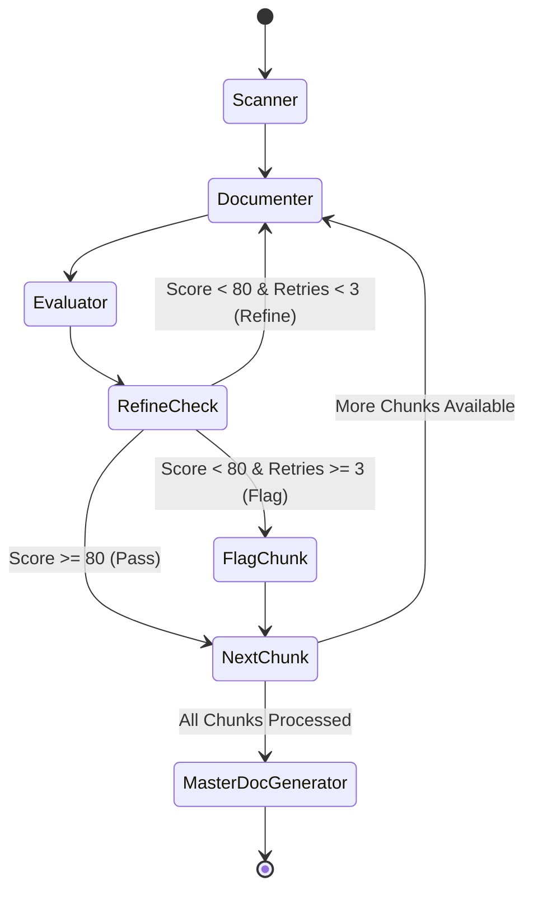

# `src/orchestrator/` — LangGraph Pipeline Orchestrator

This directory contains the core state machine driving the **Phase 1 Legacy Code Understanding Pipeline** using **LangGraph**.

---

## 🔄 Pipeline Workflow

The workflow is constructed as a `StateGraph` in [`phase1_graph.py`](file:///c:/Users/PrajwalP/Documents/GenAI%20-%20UC2/src/orchestrator/phase1_graph.py):

---

## ⚙️ Key Stages & State Management

1. **`scanner_node`**:
   - Runs static dependency analysis across all input files.
   - Condenses cyclic calls into a DAG via Tarjan's SCC.
   - Computes topological processing queue and splits oversized chunks.
2. **`documenter_node`**:
   - Processes the `current_chunk` via `DocumenterAgent`.
   - Injects feedback from prior evaluation attempts during refinement loops.
3. **`evaluator_node`**:
   - Evaluates the chunk documentation against 6 quality dimensions.
   - Determines routing: `pass`, `refine`, or `flag`.
4. **`master_doc_node`**:
   - Compiles all approved chunk documentation into `docs/documentation.md`.
   - Exports unresolved/flagged chunks into `docs/flagged_items.json`.

---

## 📁 Files

- [`phase1_graph.py`](file:///c:/Users/PrajwalP/Documents/GenAI%20-%20UC2/src/orchestrator/phase1_graph.py): Full LangGraph state machine definition, routing conditions, and node implementations.
