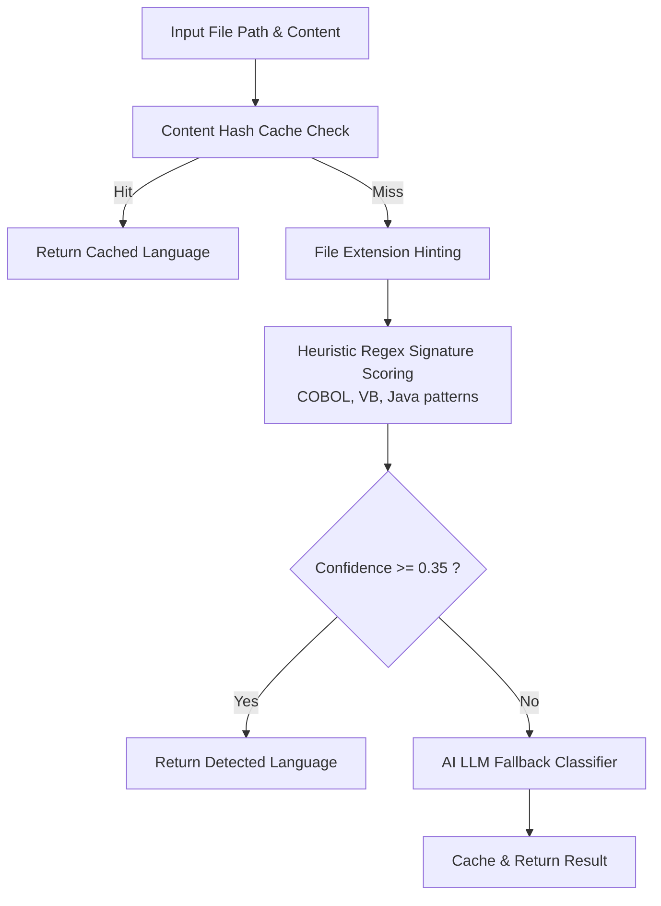

# `src/parsing/` — Multi-Language Detection Engine

This directory contains the language identification engine responsible for classifying legacy source code before parsing.

---

## 🔍 Architecture: Two-Tier Classification Strategy

To balance **speed, cost, and classification accuracy**, [`language_detector.py`](file:///c:/Users/PrajwalP/Documents/GenAI%20-%20UC2/src/parsing/language_detector.py) implements a multi-level detection hierarchy:

---

## 🎯 Supported Languages

| Language | Supported Extensions | Signature Heuristics |
| :--- | :--- | :--- |
| **COBOL** | `.cbl`, `.cob`, `.cpy`, `.pco` | `IDENTIFICATION DIVISION`, `WORKING-STORAGE SECTION`, `PERFORM`, `PIC X` |
| **Visual Basic / VBA** | `.bas`, `.frm`, `.cls`, `.vbs`, `.vb` | `Attribute VB_Name`, `Sub`, `Function`, `End Sub`, `Dim ... As`, `MsgBox` |
| **Java** | `.java` | `public class`, `import java.`, `public static void main`, `System.out` |

---

## 📁 Files

- [`language_detector.py`](file:///c:/Users/PrajwalP/Documents/GenAI%20-%20UC2/src/parsing/language_detector.py): Implements `LanguageDetector` with regex scoring, caching, and LLM fallback.
